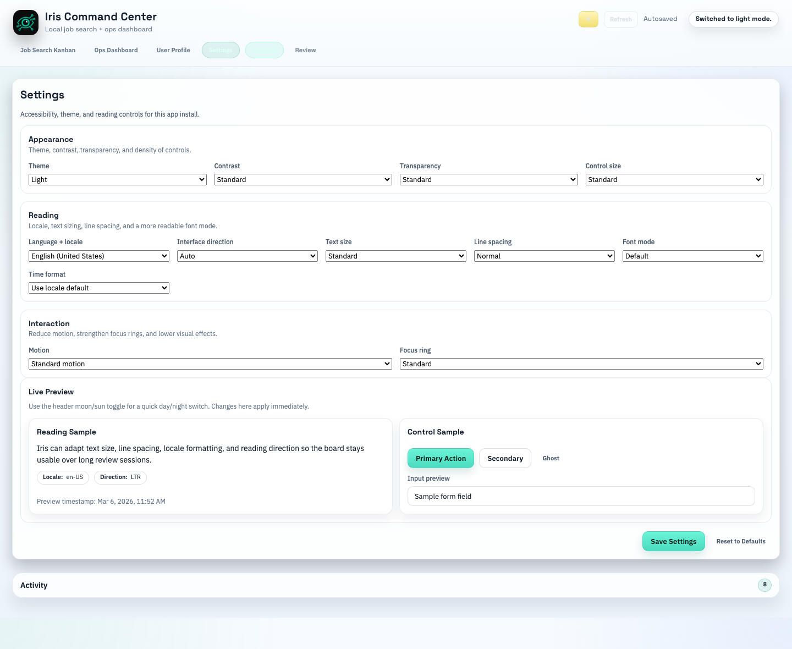

# Iris Command Center Beta

Local-first job search operating system for macOS.

## Download

Download the latest beta from the [Releases](../../releases) page.

## What it does

- AI-powered job discovery with Scout
- Job-search Kanban for applications, follow-ups, and pipeline tracking
- Ops Dashboard for daily priorities and weekly review
- User Profile that improves Scout signal quality over time

## Install (macOS)

1. Open the latest Release.
2. Download the `.dmg` file.
3. Open it.
4. Drag **Iris Command Center Beta** into **Applications**.
5. Open the app from **Applications**.

## Unsigned beta note

This beta is not yet signed or notarized.

If macOS blocks it:

1. Right-click the app in **Applications** and choose **Open**.
2. If needed, go to **System Settings > Privacy & Security**.
3. Scroll down and click **Open Anyway**.

## Screenshot

